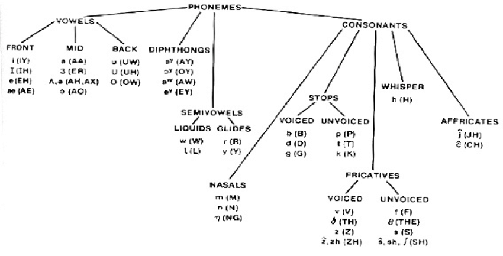

## Phonemes
Each phoneme object stores, for every instance of the phoneme in a voice's data:
- word (expressed in graphemes)
- interval index within words
- previous phoneme in word (if any)
- next phonemes in word (if any)
- frequency content metric

## PhonemeDataloader
Loads all WAV and `TextGrid` data for one voice in [data](../data). Indexable by word or phoneme, with optional desired previous/next phoneme or phoneme type as defined in [typemes.py](typemes.py) and derived from the phoneme hierarchy diagram below[^1]. Provides a method for finding the optimal phoneme for a target synthesised phoneme given (optionally) the previous and/or next target phoneme to synthesise. 

[^1]: A. M. Alkababji, “Best Wavelet Filter for a Wavelet Neural Fricatives Recognition System,” Al-Rafidain Engineering Journal (AREJ), vol. 19, no. 6, pp. 138–150, Dec. 2011. doi:10.33899/rengj.2011.26617 
